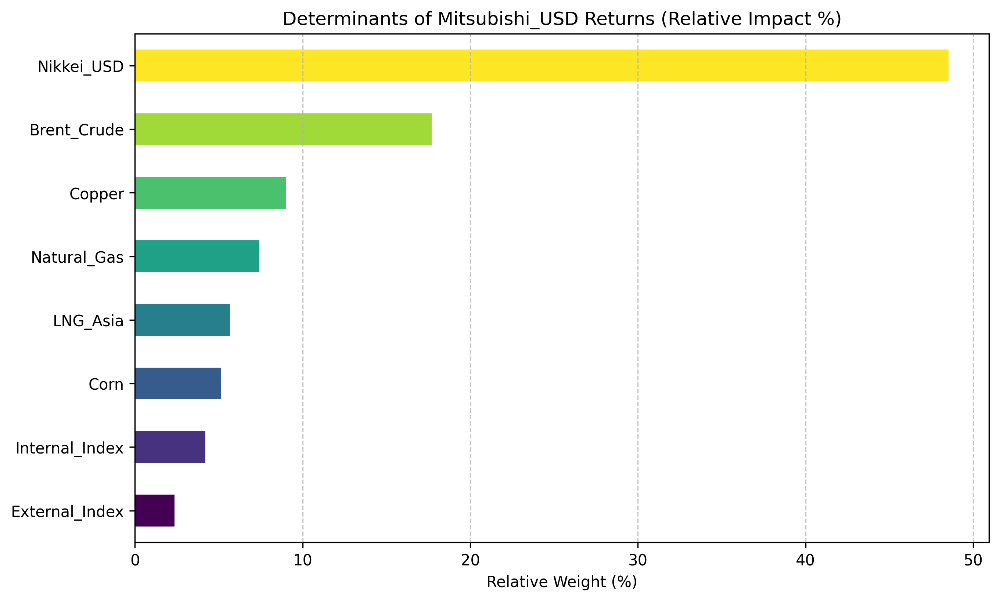
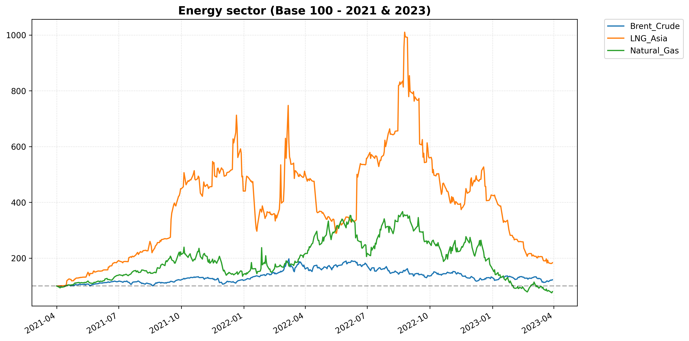
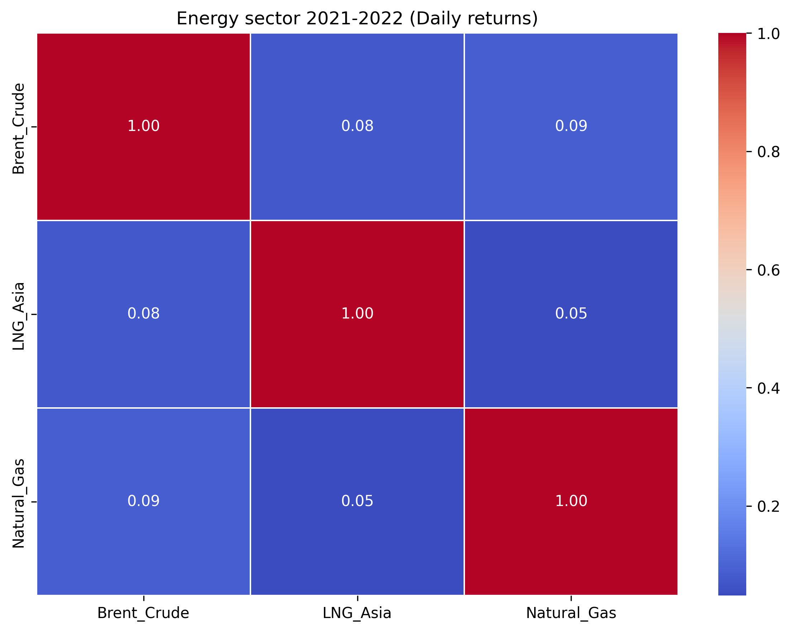
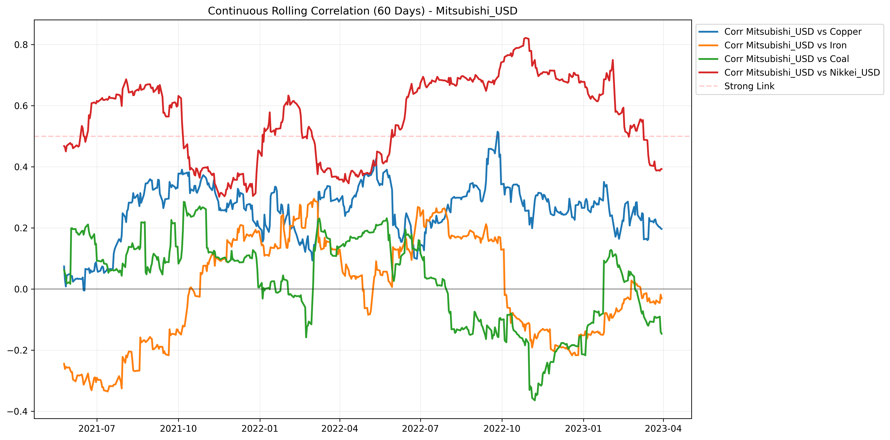
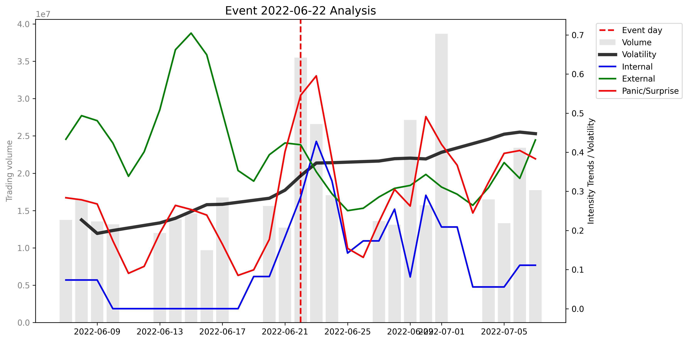
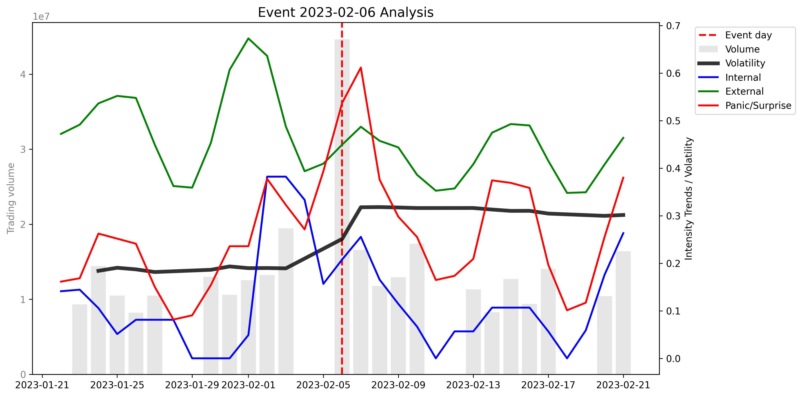

# MakroMetriks-Insights
[](https://www.python.org/)
[](LICENSE)

MakroMetriks-Insights is a **Python-based modular econometric analysis system** for systematic factor attribution and anomaly detection in equity markets. Currently, the framework is calibrated using Mitsubishi Corporation (8058.T) as a reference, but future versions are designed to support any equity or sector of interest.

The system decomposes equity returns into commodity sector exposures and alternative sentiment drivers through a **three-module analytical architecture**.

- **Commodity Exposure Module**: Evaluates equity sensitivity to global raw materials (Metallurgical, Energy, and Agricultural sectors)
- **Alternative Data Module (Google Trends)**: Automated extraction, cleansing, and normalization of Google Trends volume to measure market sentiment.
- **Integrated Factor Model**: Aggregates macro factors and alternative sentiment signals into a unified comparative report.

---

## Tech Stack

### Core Language
- **Python 3.9.6**

### Data Engineering & Processing
- pandas  
- numpy  

### Financial & Alternative Data Sources
- yfinance (market data ingestion)  
- pytrends (Google Trends sentiment extraction)  

### Econometrics & Statistical Modeling
- statsmodels (OLS regression, diagnostics, Granger causality)  
- scipy (statistical testing)  

### Visualization & Reporting
- matplotlib  
- seaborn  
- xlsxwriter  
- openpyxl  

___

## Key Features
- Multi-factor OLS regression with standardized returns  
- Statistical validation: ADF stationarity, VIF multicollinearity, Durbin-Watson autocorrelation  
- Granger causality testing for lead-lag relationships  
- Residual-based event detection (Z-score classification)  
- Google Trends integration (Internal, External, Panic sentiment indices)  
- Automated Excel dashboards with color-coded coefficients and charts

---

## Quick Start
```bash
git clone https://github.com/vivaso86/MakroMetriks-Insights.git
cd MakroMetriks-Insights
pip install -r requirements.txt
```
The current version follows a modular research workflow. Notebooks should be executed sequentially:
1. Commodity Module
2. Alternative Data Module
3. Main Pipeline

## Analytical Insights & Outputs
The framework translates regression outputs into structured visual diagnostics for factor interpretation.

### 1. Factor Attribution
This visualization decomposes **Mitsubishi Corp's (8058.T)** returns, isolating systematic macro exposure from sentiment drivers. It answers what is truly moving the stock

<p align="center">
  
</p>

### 2. Sectoral Dynamics & Market Regime
We monitor the stability of relationships between equity prices and global commodity benchmarks. The system identifies shifts in correlation that precede structural price moves.

<p align="center">
  
  
</p>
<p align="center">
  
</p>

### 3. Event Diagnosis: Sentiment
The system uses a **Z-Score classification engine** to audit historical price shocks. By cross-referencing internal corporate interest against global market panic, the model distinguishes between genuine corporate crises and unlinked market noise.

| Case Study: Jun 2022 (Geopolitical Risk) | Case Study: Feb 2023 (Market Noise) |
|:---:|:---:|
|  |  |
| **Z-Internal: 4.79** (Extreme Interest) | **Z-Internal: 0.57** (Low Interest) |
| **Z-Panic: 3.96** (High Anxiety) | **Z-Panic: 3.32** (High Anxiety) |
| **Verdict:** INTERNAL (Corporate Event) 🚨 | **Verdict:** Market Noise 📉 |

> **Strategic Insight:** The June 2022 diagnosis correctly flagged the **Sakhalin-2 energy crisis** (Russia's decree on asset seizure), where Mitsubishi Corp holds a 10% stake. Conversely, the February 2023 spike in global panic was correctly identified as **noise**, as internal interest in the ticker remained flat.


---

## Limitations
- **Not intended for price prediction** — the model focuses on factor attribution and identifying key drivers of equity returns, not forecasting future prices
- **Single-asset scope** — currently calibrated for Mitsubishi Corp.; adapting the model to other equities requires updating data inputs and factor configuration.
- **Google Trends data** - limited and normalized data complicates precise predictions
- **Simplified factor universe** — only a limited set of commodities, FX, indices, and Google Trends signals; may omit relevant drivers.

---

## Future improvements
- **Multi-equity and multi-sector scalability** — extend the framework to analyze any company and sector, providing flexible factor selection and broader applicability.  
- **User-friendly interfaces** — create intuitive input/output interfaces to simplify analysis setup and allow non-technical users to run custom equity studies.  
- **Robust and fully automated workflow** — enhance error handling and reliability to make the entire data ingestion, analysis, and reporting process fully automatic and resilient.

---

## License & Authorship
**Victor Valle Solar** [LinkedIn](https://www.linkedin.com/in/victor-valle-solar-5b4a402a7/)  [GitHub](github.com/vivaso86)

This project is licensed under the MIT License.
You are free to use, modify, and distribute this work with attribution.

**© MakroMetriks Insights · Victor Valle Solar**
